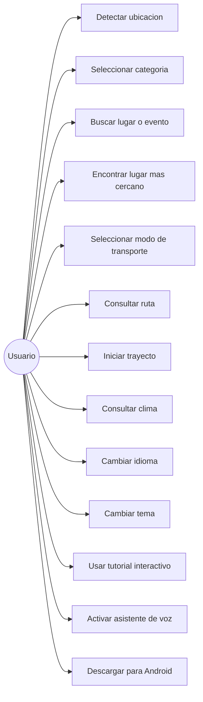
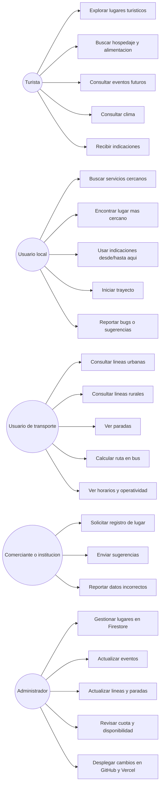
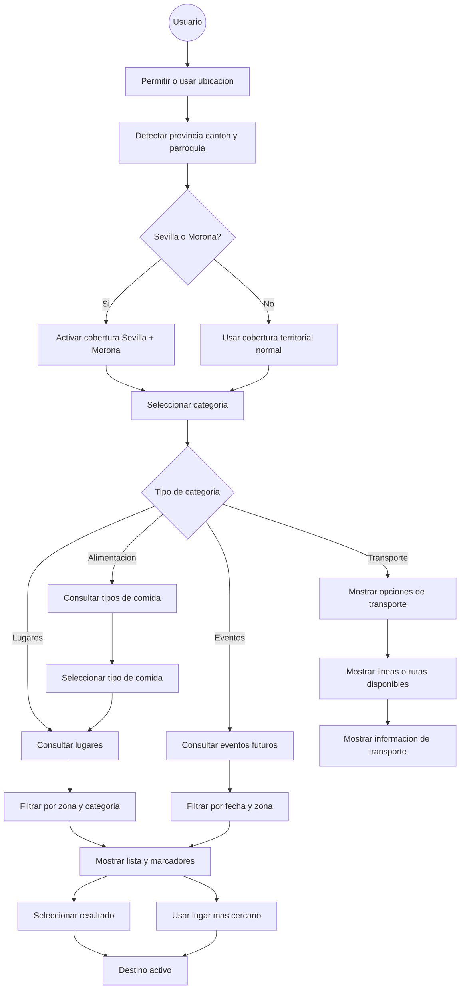
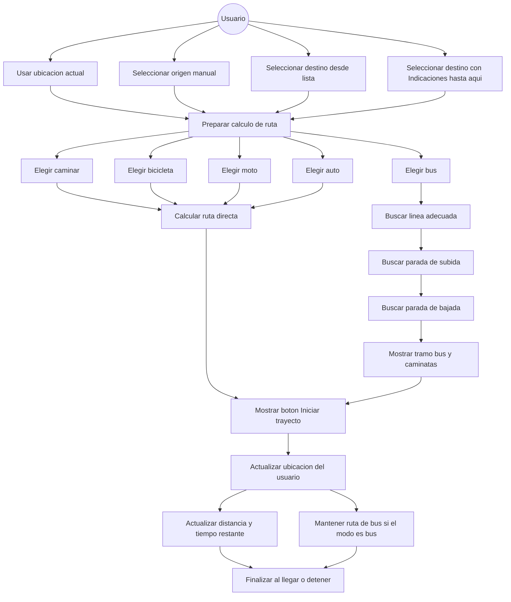
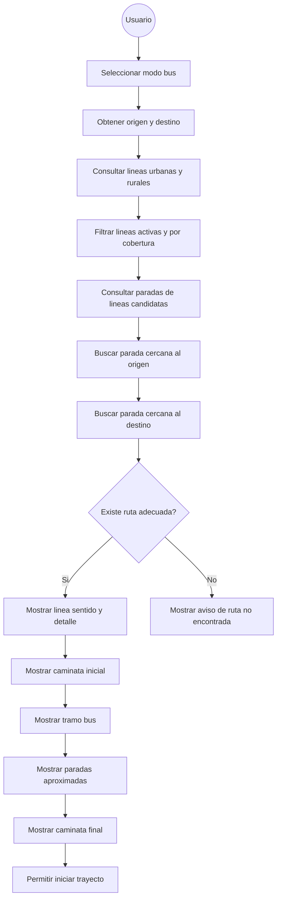
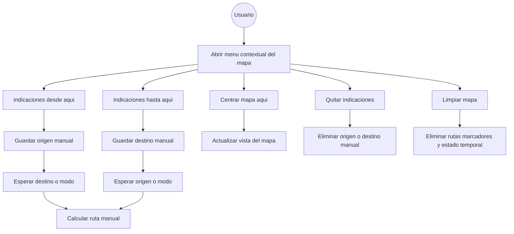
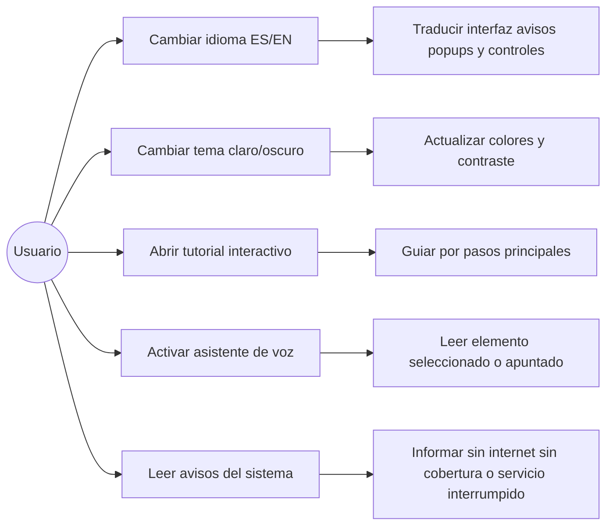
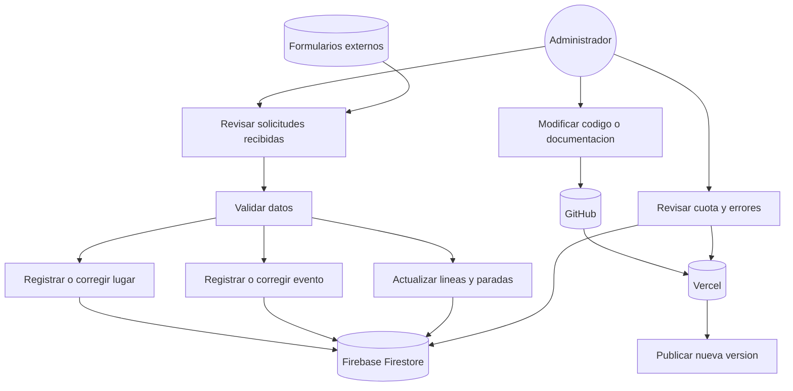
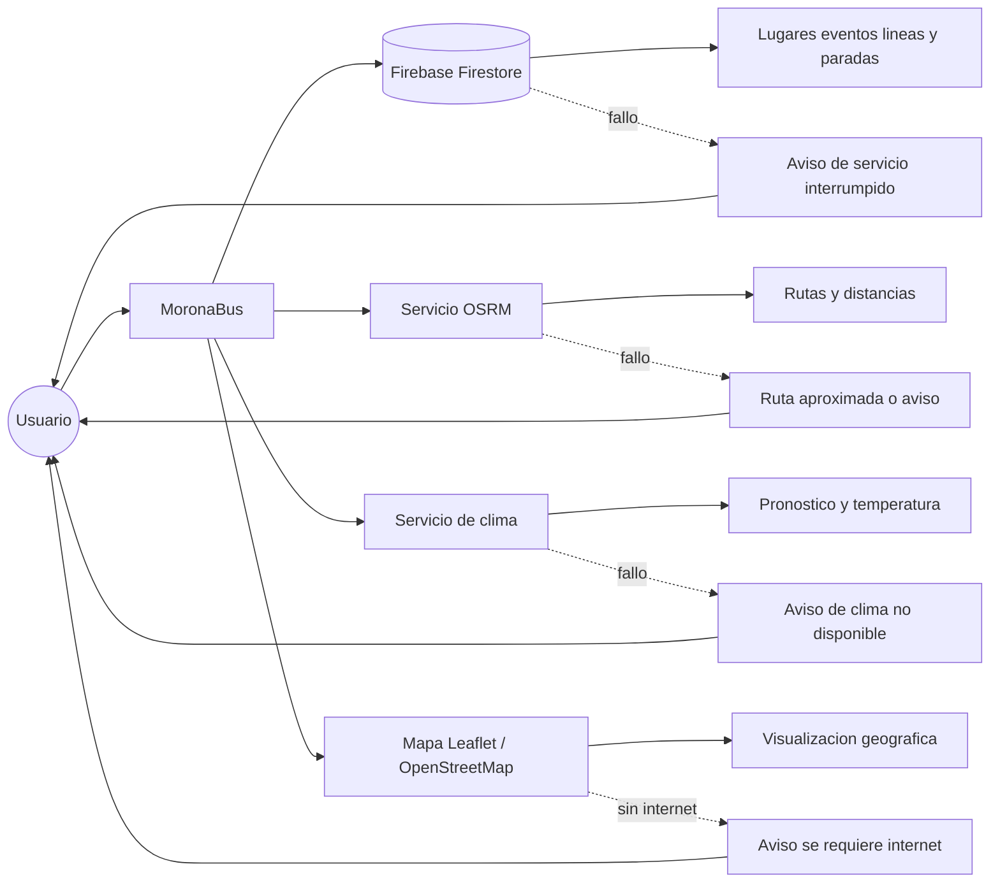

# Documentacion del Proyecto MoronaBus

## 1. Portada

**Nombre del proyecto:** MoronaBus  
**Tipo de sistema:** Aplicacion web progresiva orientada a transporte, turismo y servicios  
**Area de cobertura principal:** Macas, Morona, Sevilla Don Bosco y Morona Santiago, Ecuador  
**Autor / responsable:** Edison Flores  
**Repositorio:** `https://github.com/EdisonFlores/MoronaBus.git`  
**URL de produccion:** `https://moronabus.vercel.app/`  
**Fecha de documentacion:** Julio de 2026  
**Version referencial:** 1.0

MoronaBus es una plataforma web que permite consultar rutas de bus, paradas, terminales, lugares turisticos, servicios, eventos y puntos de interes mediante un mapa interactivo. El sistema integra geolocalizacion, rutas por diferentes modos de transporte, informacion climatica, soporte de idioma, tutorial interactivo, asistencia por voz y funcionamiento tipo PWA.

## 2. Resumen del proyecto

MoronaBus nace como una herramienta para facilitar la movilidad y la exploracion de servicios en Morona Santiago. La aplicacion combina informacion de transporte urbano y rural con datos turisticos y comerciales, permitiendo al usuario encontrar lugares cercanos, visualizar rutas, consultar lineas de transporte y recibir indicaciones desde su ubicacion actual o desde puntos seleccionados manualmente en el mapa.

La plataforma esta pensada para turistas, habitantes locales y usuarios que necesitan orientarse dentro del territorio. En vez de separar turismo, transporte y servicios en sistemas distintos, MoronaBus los reune en una sola experiencia basada en mapa.

El sistema depende de una base de datos en Firebase Firestore para consultar lugares, eventos, lineas, paradas y division territorial. Tambien usa servicios externos para rutas, mapa, clima y geocodificacion. Por eso incluye avisos cuando no hay internet o cuando ocurre una interrupcion temporal de servicios externos.

## 3. Objetivos

### 3.1 Objetivo general

Desarrollar una plataforma digital que permita a usuarios locales y visitantes consultar informacion de transporte, turismo y servicios en Morona Santiago mediante un mapa interactivo, rutas calculadas y datos actualizados desde una base de datos.

### 3.2 Objetivos especificos

- Facilitar la busqueda de lugares por categoria, canton, parroquia y cercania.
- Mostrar rutas hacia lugares seleccionados usando varios modos de traslado.
- Integrar transporte publico urbano y rural con lineas, paradas, sentidos y horarios.
- Permitir que el usuario consulte indicaciones desde o hacia cualquier punto del mapa.
- Detectar la ubicacion del usuario para personalizar los resultados.
- Ofrecer una experiencia accesible con tutorial, asistente de voz y traduccion de interfaz.
- Proveer una experiencia responsive para celulares, tablets y escritorio.
- Mantener una capa de avisos ante fallos de internet, servicios externos o base de datos.
- Publicar el sistema como aplicacion web desplegable en Vercel y como PWA instalable.

## 4. Requerimientos del sistema

Los requerimientos describen lo que MoronaBus debe permitir realizar y las condiciones minimas que debe cumplir para funcionar correctamente. Se dividen en requerimientos funcionales y no funcionales.

### 4.1 Criterios de prioridad

| Prioridad | Significado |
|---|---|
| Alta | Requerimiento indispensable para que la plataforma cumpla su objetivo principal. Si falla, afecta directamente el uso esencial de MoronaBus. |
| Media | Requerimiento importante para mejorar experiencia, accesibilidad o calidad del servicio, pero no detiene por completo el funcionamiento principal. |
| Baja | Requerimiento complementario o de valor agregado. Puede mejorar la experiencia, pero no es critico para operar la plataforma. |

### 4.2 Requerimientos funcionales

| Codigo | Requerimiento funcional | Prioridad | Descripcion |
|---|---|---|---|
| RF-01 | Detectar ubicacion del usuario | Alta | El sistema debe obtener la ubicacion del usuario, previa autorizacion del navegador, para centrar el mapa, mostrar su marcador y consultar datos cercanos. |
| RF-02 | Detectar contexto territorial | Alta | El sistema debe identificar provincia, canton, parroquia o entorno segun la ubicacion del usuario. |
| RF-03 | Aplicar cobertura compartida Sevilla + Morona | Alta | Cuando el usuario este en Sevilla Don Bosco o Morona, el sistema debe mostrar datos de ambos cantones sin cambiar el canton detectado en pantalla. |
| RF-04 | Mostrar categorias de servicios | Alta | El sistema debe permitir seleccionar categorias como transporte, alimentacion, salud, turismo, comercio, educacion, instituciones y otros servicios. |
| RF-05 | Consultar lugares registrados | Alta | El sistema debe cargar lugares desde la base de datos y filtrarlos segun categoria, provincia, canton y cobertura aplicable. |
| RF-06 | Mostrar marcadores en el mapa | Alta | El sistema debe representar los lugares, eventos, paradas y puntos seleccionados mediante marcadores en el mapa interactivo. |
| RF-07 | Seleccionar un lugar desde lista desplegable | Alta | El usuario debe poder seleccionar un destino desde una lista de resultados para calcular rutas y ver informacion relacionada. |
| RF-08 | Calcular lugar mas cercano | Alta | El sistema debe determinar el lugar o evento mas cercano a la ubicacion actual del usuario dentro de los resultados disponibles. |
| RF-09 | Consultar eventos futuros | Media | El sistema debe mostrar eventos futuros registrados y permitir calcular rutas hacia ellos. |
| RF-10 | Filtrar alimentacion por tipo de comida | Media | El sistema debe permitir seleccionar un tipo de comida antes de mostrar restaurantes o lugares de alimentacion. |
| RF-11 | Seleccionar modo de transporte | Alta | El usuario debe poder elegir entre caminar, bicicleta, moto, auto o bus para consultar indicaciones. |
| RF-12 | Calcular ruta por modos individuales | Alta | El sistema debe calcular rutas para caminar, bicicleta, moto y auto cuando exista origen y destino. |
| RF-13 | Calcular ruta en bus | Alta | El sistema debe buscar una linea adecuada, parada de subida, parada de bajada, tramo de bus, caminata inicial, caminata final y paradas aproximadas. |
| RF-14 | Consultar lineas de transporte urbano | Alta | El usuario debe poder consultar lineas urbanas, horarios, estado operativo y paradas asociadas. |
| RF-15 | Consultar lineas de transporte rural | Alta | El usuario debe poder consultar lineas rurales, horarios de ida/retorno, dias de operacion y paradas relacionadas. |
| RF-16 | Usar indicaciones desde aqui | Alta | El usuario debe poder seleccionar un punto del mapa como origen manual. |
| RF-17 | Usar indicaciones hasta aqui | Alta | El usuario debe poder seleccionar un punto del mapa como destino manual. |
| RF-18 | Limpiar indicaciones y mapa | Media | El sistema debe permitir quitar rutas, marcadores temporales y selecciones activas. |
| RF-19 | Iniciar trayecto | Alta | El sistema debe permitir activar seguimiento de ubicacion despues de seleccionar destino y modo de transporte. |
| RF-20 | Detener trayecto | Alta | El usuario debe poder finalizar el seguimiento manualmente desde el boton correspondiente. |
| RF-21 | Actualizar ubicacion durante trayecto | Alta | El sistema debe actualizar el marcador del usuario mientras avanza y mostrar informacion restante del recorrido. |
| RF-22 | Mantener ruta de bus durante trayecto | Alta | En modo bus, el sistema debe mantener la ruta de bus calculada y no recalcular la linea en cada actualizacion GPS. |
| RF-23 | Mostrar clima | Media | El sistema debe mostrar clima y pronostico relacionado con la ubicacion del usuario o centro del mapa. |
| RF-24 | Cambiar idioma | Media | La interfaz, avisos, popups, modales y controles deben poder mostrarse en espanol o ingles, sin traducir datos consultados desde la BD. |
| RF-25 | Cambiar tema visual | Media | El usuario debe poder alternar entre tema claro y oscuro. |
| RF-26 | Mostrar tutorial interactivo | Media | El sistema debe guiar al usuario por las funcionalidades principales mediante un tutorial responsive. |
| RF-27 | Activar asistente de voz | Media | El usuario debe poder activar o desactivar lectura por voz de elementos seleccionados o apuntados con el mouse. |
| RF-28 | Descargar version Android | Baja | El footer debe incluir un enlace de descarga para Android. |
| RF-29 | Mostrar formularios externos | Baja | El sistema debe enlazar formularios para registrar lugares y reportar bugs o sugerencias. |
| RF-30 | Mostrar aviso sin internet | Alta | El sistema debe indicar cuando se requiere conexion para cargar datos, mapa, rutas o clima. |
| RF-31 | Mostrar aviso de servicio interrumpido | Alta | El sistema debe indicar cuando un servicio externo o la base de datos falla, aclarando que la interrupcion no es culpa de la app. |
| RF-32 | Cachear datos temporalmente | Media | El sistema debe reducir llamadas repetidas a la API mediante cache temporal de colecciones. |

### 4.3 Requerimientos no funcionales

| Codigo | Requerimiento no funcional | Prioridad | Descripcion |
|---|---|---|---|
| RNF-01 | Responsividad | Alta | La interfaz debe adaptarse a celulares, tablets y pantallas de escritorio. |
| RNF-02 | Usabilidad | Alta | Los controles deben ser claros, visibles y faciles de usar para turistas y habitantes locales. |
| RNF-03 | Disponibilidad informativa | Alta | La app debe informar claramente cuando no hay internet, no hay cobertura o falla un servicio externo. |
| RNF-04 | Rendimiento | Media | La aplicacion debe evitar consultas repetidas y usar cache para mejorar tiempos de respuesta. |
| RNF-05 | Accesibilidad | Media | La app debe apoyar lectura por voz, textos claros, contraste con tema oscuro y controles comprensibles. |
| RNF-06 | Mantenibilidad | Media | El codigo debe estar organizado por modulos para facilitar cambios en rutas, mapa, transporte, idioma y servicios. |
| RNF-07 | Seguridad | Alta | Las credenciales de Firebase Admin deben permanecer en backend y variables de entorno, nunca en el frontend. |
| RNF-08 | Escalabilidad | Media | El sistema debe permitir agregar nuevas categorias, lugares, lineas, paradas y eventos sin rehacer la arquitectura. |
| RNF-09 | Compatibilidad | Media | La aplicacion debe funcionar en navegadores modernos con soporte para ES Modules, geolocalizacion y APIs web. |
| RNF-10 | Tolerancia a fallos | Alta | Si OSRM, clima, Firestore o red fallan, la app debe mostrar avisos o rutas aproximadas cuando sea posible. |

## 5. Diagramas de caso de uso

Los diagramas de caso de uso muestran como los actores interactuan con MoronaBus. Sirven para visualizar el alcance funcional desde el punto de vista del usuario, del responsable del proyecto y de los servicios externos que hacen posible la plataforma.

En esta documentacion los diagramas se representan con Mermaid usando diagramas de flujo, porque permiten incluir actores, relaciones y dependencias dentro del mismo archivo Markdown.

### 5.1 Diagrama general de uso de MoronaBus

#### Subtitulo

Vista general de las funciones principales disponibles para cualquier usuario de la plataforma.

#### Descripcion

Este diagrama resume las acciones esenciales que puede realizar una persona al ingresar a MoronaBus. El usuario puede permitir la deteccion de ubicacion, seleccionar una categoria, buscar lugares o eventos, consultar el lugar mas cercano, elegir un modo de transporte, obtener una ruta, iniciar el seguimiento del trayecto, consultar clima, cambiar idioma, cambiar tema, usar el tutorial, activar el asistente de voz y descargar la version Android.

La finalidad del diagrama es mostrar la aplicacion como un sistema unificado: no solo es un mapa, sino una plataforma de movilidad, turismo, servicios, accesibilidad e informacion contextual.



#### Casos de uso representados

| Codigo | Caso de uso | Actor principal | Prioridad | Descripcion |
|---|---|---|---|---|
| CU-01 | Detectar ubicacion | Usuario | Alta | El sistema obtiene la ubicacion del usuario para centrar el mapa y filtrar datos cercanos. |
| CU-02 | Seleccionar categoria | Usuario | Alta | El usuario elige el tipo de informacion que desea consultar. |
| CU-03 | Buscar lugar o evento | Usuario | Alta | El usuario selecciona un destino desde una lista desplegable. |
| CU-04 | Encontrar lugar mas cercano | Usuario | Alta | El sistema calcula el punto mas cercano dentro de los resultados disponibles. |
| CU-05 | Consultar ruta | Usuario | Alta | El sistema muestra una ruta hacia el destino elegido. |
| CU-06 | Iniciar trayecto | Usuario | Alta | El usuario activa seguimiento de ubicacion durante el recorrido. |
| CU-07 | Usar herramientas de apoyo | Usuario | Media | Incluye clima, idioma, tema, tutorial y asistente de voz. |
| CU-08 | Descargar Android | Usuario | Baja | El usuario accede a la descarga de la version Android desde el footer. |

#### Precondiciones

- El usuario debe tener acceso a la aplicacion web.
- Para usar ubicacion, el navegador debe permitir geolocalizacion.
- Para cargar datos actualizados, debe existir conexion a internet.

#### Resultado esperado

El usuario encuentra informacion util de transporte, turismo o servicios y puede llegar a un destino con ayuda del mapa y de las rutas calculadas.

### 5.2 Diagrama de caso de uso por actores

#### Subtitulo

Participacion de turista, usuario local, usuario de transporte, comerciante/institucion y administrador.

#### Descripcion

Este diagrama separa las acciones segun el tipo de actor. El turista se enfoca en descubrir lugares, hospedaje, alimentacion, eventos y clima. El usuario local usa la plataforma para ubicar servicios cercanos, calcular rutas y reportar sugerencias. El usuario de transporte consulta lineas, paradas, horarios y rutas en bus. Los comerciantes o instituciones se relacionan con la plataforma mediante formularios para registrar lugares o sugerir cambios. El administrador mantiene la informacion en Firestore, revisa disponibilidad y despliega cambios.

Esta separacion ayuda a entender que MoronaBus no atiende a un solo tipo de persona. El sistema puede ser usado por visitantes, habitantes, personas que se movilizan diariamente, responsables de informacion y actores que desean aparecer en la plataforma.



#### Casos de uso representados

| Actor | Casos de uso principales | Objetivo |
|---|---|---|
| Turista | Explorar lugares, buscar hospedaje, consultar eventos, clima e indicaciones | Descubrir sitios utiles y movilizarse con mayor facilidad. |
| Usuario local | Buscar servicios, encontrar lugares cercanos, usar indicaciones, iniciar trayecto | Resolver necesidades cotidianas de ubicacion y movilidad. |
| Usuario de transporte | Consultar lineas, paradas, horarios y rutas en bus | Saber que bus tomar, donde subir y donde bajar. |
| Comerciante o institucion | Registrar lugar, enviar sugerencias, reportar datos incorrectos | Solicitar presencia o correccion de datos en la plataforma. |
| Administrador | Gestionar datos, revisar cuota, actualizar rutas, desplegar cambios | Mantener la plataforma operativa y actualizada. |

#### Precondiciones

- Los usuarios finales acceden desde navegador web.
- Los comerciantes o instituciones usan los formularios externos.
- El administrador tiene acceso a Firestore, GitHub, Vercel y variables de entorno.

#### Resultado esperado

Cada actor puede cumplir su objetivo sin necesitar conocer la estructura tecnica interna del sistema.

### 5.3 Diagrama de caso de uso de busqueda de lugares y eventos

#### Subtitulo

Flujo de consulta de categorias, lugares, eventos, filtros y resultados en el mapa.

#### Descripcion

Este diagrama detalla como el usuario llega desde una categoria hasta un resultado concreto. Primero la aplicacion detecta el contexto territorial. Luego el usuario selecciona categoria. Si la categoria corresponde a lugares, se consultan registros de Firestore y se muestran en lista y mapa. Si corresponde a eventos, se filtran eventos futuros. Si corresponde a alimentacion, se puede filtrar por tipo de comida antes de mostrar restaurantes.

El caso tambien contempla la cobertura compartida Sevilla + Morona, que permite ampliar resultados sin alterar la ubicacion detectada.



#### Casos de uso representados

| Codigo | Caso de uso | Actor principal | Prioridad | Descripcion |
|---|---|---|---|---|
| CU-09 | Detectar contexto territorial | Usuario | Alta | La app define zona de consulta segun ubicacion real. |
| CU-10 | Aplicar cobertura compartida | Usuario | Alta | Si el usuario esta en Sevilla o Morona, se amplian resultados. |
| CU-11 | Consultar lugares por categoria | Usuario | Alta | Carga datos de lugares y los filtra por categoria y zona. |
| CU-12 | Consultar eventos futuros | Usuario | Media | Muestra eventos vigentes o proximos. |
| CU-13 | Filtrar por tipo de comida | Usuario | Media | Permite encontrar opciones de alimentacion mas especificas. |
| CU-14 | Seleccionar resultado | Usuario | Alta | Convierte un lugar o evento en destino activo. |

#### Flujo principal

1. El usuario ingresa a la app.
2. La app detecta ubicacion y contexto territorial.
3. El usuario selecciona una categoria.
4. La app consulta y filtra datos.
5. Se muestran resultados en lista y mapa.
6. El usuario selecciona un lugar o usa "Lugar mas cercano".

#### Flujos alternativos

- Si no hay datos, se muestra aviso de sin cobertura.
- Si falla la API o Firestore, se muestra aviso de funcionamiento interrumpido.
- Si no hay ubicacion, el usuario puede apoyarse en indicaciones manuales desde el mapa.

### 5.4 Diagrama de caso de uso de transporte y trayecto

#### Subtitulo

Proceso de seleccion de destino, modo de transporte, ruta e inicio de trayecto.

#### Descripcion

Este diagrama detalla el flujo de movilidad. El usuario puede partir desde su ubicacion real o desde un punto manual del mapa. Luego selecciona destino, escoge modo de transporte y consulta la ruta. Si elige caminar, bicicleta, moto o auto, se calcula una ruta directa. Si elige bus, el sistema busca una linea adecuada, parada de subida, parada de bajada, tramo de bus, caminata inicial y caminata final.

Cuando el usuario inicia trayecto, la app actualiza la ubicacion en tiempo real. En modo bus, el sistema conserva la ruta calculada y evita recalcular la linea en cada movimiento, porque el objetivo es seguir la ruta ya elegida y no buscar alternativas constantemente.



#### Casos de uso representados

| Codigo | Caso de uso | Actor principal | Prioridad | Descripcion |
|---|---|---|---|---|
| CU-15 | Seleccionar origen | Usuario | Alta | Puede usarse ubicacion actual u origen manual. |
| CU-16 | Seleccionar destino | Usuario | Alta | Puede venir de lista o de "Indicaciones hasta aqui". |
| CU-17 | Elegir modo de transporte | Usuario | Alta | Define como se calculara o mostrara la ruta. |
| CU-18 | Calcular ruta directa | Usuario | Alta | Aplica para caminar, bicicleta, moto y auto. |
| CU-19 | Calcular ruta en bus | Usuario | Alta | Busca linea, paradas y tramos. |
| CU-20 | Iniciar trayecto | Usuario | Alta | Activa seguimiento GPS. |
| CU-21 | Detener trayecto | Usuario | Alta | Finaliza el seguimiento. |

#### Precondiciones

- Debe existir origen y destino.
- Para seguimiento se requiere permiso de ubicacion.
- Para bus deben existir datos de lineas y paradas.

#### Resultado esperado

El usuario visualiza una ruta coherente y, si activa seguimiento, ve su ubicacion avanzar sin perder la ruta calculada.

### 5.5 Diagrama de caso de uso especifico de rutas de bus

#### Subtitulo

Planificacion de una ruta en bus urbano o rural con paradas, sentido y caminatas.

#### Descripcion

Este diagrama se centra exclusivamente en el modo bus. Es importante porque el bus tiene una logica distinta a los demas modos: no basta con unir origen y destino, sino que se debe encontrar una linea que pase cerca del usuario y tambien cerca del destino. El sistema calcula la caminata hacia la parada de subida, el tramo en bus, el numero aproximado de paradas y la caminata final.

Tambien se considera que las lineas pueden ser urbanas o rurales, tener sentidos, horarios y estados de operacion. Si no se encuentra una ruta adecuada, el sistema debe informar al usuario de forma clara.



#### Casos de uso representados

| Codigo | Caso de uso | Actor principal | Prioridad | Descripcion |
|---|---|---|---|---|
| CU-22 | Consultar lineas candidatas | Usuario | Alta | El sistema busca lineas urbanas o rurales compatibles. |
| CU-23 | Consultar paradas | Usuario | Alta | El sistema identifica paradas relacionadas con cada linea. |
| CU-24 | Calcular punto de subida | Usuario | Alta | Determina donde le conviene subir al bus. |
| CU-25 | Calcular punto de bajada | Usuario | Alta | Determina donde le conviene bajar para llegar al destino. |
| CU-26 | Mostrar detalle de ruta bus | Usuario | Alta | Presenta linea, sentido, tramo, paradas y caminatas. |
| CU-27 | Informar ruta no encontrada | Usuario | Media | Muestra un aviso cuando no existe alternativa registrada. |

#### Resultado esperado

El usuario sabe que linea tomar, hacia donde ir caminando, donde subir, cuantas paradas aproximadas recorrer y cuanto debe caminar al final.

### 5.6 Diagrama de caso de uso de mapa e indicaciones manuales

#### Subtitulo

Uso del mapa como herramienta de seleccion manual de origen, destino y acciones contextuales.

#### Descripcion

Este diagrama muestra las acciones que se activan directamente desde el mapa. El usuario puede abrir el menu contextual en un punto geografico, definirlo como origen o destino, centrar el mapa, quitar indicaciones o limpiar la vista. Esta funcionalidad complementa la seleccion desde listas, porque permite planificar rutas hacia lugares que no necesariamente estan registrados en la base de datos.



#### Casos de uso representados

| Codigo | Caso de uso | Actor principal | Prioridad | Descripcion |
|---|---|---|---|---|
| CU-28 | Abrir menu del mapa | Usuario | Media | Permite acceder a acciones contextuales sobre un punto. |
| CU-29 | Definir origen manual | Usuario | Alta | Permite iniciar una ruta desde un punto elegido. |
| CU-30 | Definir destino manual | Usuario | Alta | Permite ir hacia un punto elegido aunque no exista en la BD. |
| CU-31 | Limpiar mapa | Usuario | Media | Restaura la vista eliminando elementos temporales. |
| CU-32 | Centrar mapa | Usuario | Baja | Ajusta la vista al punto seleccionado. |

#### Resultado esperado

El usuario puede planificar rutas manuales con libertad, sin depender exclusivamente de los lugares registrados.

### 5.7 Diagrama de caso de uso de accesibilidad, idioma y ayuda

#### Subtitulo

Funciones de apoyo para mejorar comprension, accesibilidad y experiencia de usuario.

#### Descripcion

Este diagrama agrupa las funcionalidades que no son estrictamente de transporte, pero hacen que la plataforma sea mas facil de usar. Incluye cambio de idioma, tema claro/oscuro, tutorial interactivo, asistente de voz y avisos visibles. Estas funciones son importantes porque MoronaBus puede ser usado por turistas, personas nuevas en la ciudad, usuarios moviles y personas que requieren apoyo auditivo o visual.



#### Casos de uso representados

| Codigo | Caso de uso | Actor principal | Prioridad | Descripcion |
|---|---|---|---|---|
| CU-33 | Cambiar idioma | Usuario | Media | Permite usar la interfaz en espanol o ingles. |
| CU-34 | Cambiar tema | Usuario | Media | Permite adaptar la visualizacion a preferencia o condiciones de luz. |
| CU-35 | Usar tutorial | Usuario | Media | Explica las funciones principales de forma guiada. |
| CU-36 | Activar asistente de voz | Usuario | Media | Lee elementos al seleccionarlos o apuntarlos. |
| CU-37 | Recibir avisos | Usuario | Alta | Informa problemas de internet, cobertura o servicios externos. |

#### Resultado esperado

La plataforma es mas comprensible, accesible y facil de usar para distintos tipos de usuarios.

### 5.8 Diagrama de caso de uso de administracion de datos

#### Subtitulo

Mantenimiento de informacion en Firestore, GitHub y Vercel.

#### Descripcion

Este diagrama representa las tareas del administrador o responsable tecnico. Aunque MoronaBus no tiene aun un panel administrativo completo en la app publica, el mantenimiento existe mediante Firestore, formularios, repositorio y despliegue. El administrador registra o corrige lugares, eventos, lineas, paradas, revisa errores, controla cuota de Firebase y publica cambios.



#### Casos de uso representados

| Codigo | Caso de uso | Actor principal | Prioridad | Descripcion |
|---|---|---|---|---|
| CU-38 | Revisar solicitudes | Administrador | Media | Atiende registros de lugares, bugs y sugerencias. |
| CU-39 | Validar datos | Administrador | Alta | Comprueba coordenadas, categorias, nombres y estado activo. |
| CU-40 | Actualizar Firestore | Administrador | Alta | Mantiene lugares, eventos, lineas y paradas. |
| CU-41 | Publicar cambios | Administrador | Alta | Sube cambios a GitHub para despliegue en Vercel. |
| CU-42 | Revisar cuota y errores | Administrador | Alta | Controla disponibilidad y evita interrupciones del servicio. |

#### Resultado esperado

La informacion se mantiene actualizada, coherente y disponible para los usuarios finales.

### 5.9 Diagrama de caso de uso de datos y servicios externos

#### Subtitulo

Relacion entre MoronaBus, Firestore, APIs externas y avisos al usuario.

#### Descripcion

Este diagrama muestra que la aplicacion depende de servicios externos para entregar informacion actualizada. Firestore proporciona datos de lugares, eventos, lineas y paradas. OSRM apoya el calculo de rutas. El servicio de clima entrega pronosticos. Leaflet/OpenStreetMap permite visualizar el mapa. Cuando alguno de estos servicios falla, MoronaBus debe informar al usuario mediante avisos claros.

El objetivo de este caso de uso es explicar que algunas interrupciones pueden estar fuera del codigo de la app: cuota de Firestore, problemas de red, caida de proveedor de rutas o indisponibilidad del servicio de clima.



#### Casos de uso representados

| Codigo | Caso de uso | Actor principal | Prioridad | Descripcion |
|---|---|---|---|---|
| CU-43 | Consultar Firestore | Sistema | Alta | Obtiene datos principales de la plataforma. |
| CU-44 | Consultar OSRM | Sistema | Alta | Calcula rutas y distancias. |
| CU-45 | Consultar clima | Sistema | Media | Obtiene informacion meteorologica. |
| CU-46 | Mostrar mapa | Sistema | Alta | Renderiza base geografica y capas. |
| CU-47 | Informar interrupciones | Sistema | Alta | Muestra avisos cuando un servicio externo falla. |

#### Resultado esperado

El usuario recibe datos cuando los servicios responden y avisos claros cuando alguno falla.

### 5.10 Resumen de actores y responsabilidades

| Actor | Responsabilidad dentro del sistema | Funciones relacionadas |
|---|---|---|
| Usuario general | Usar la app para buscar, ubicarse y consultar rutas | Categorias, lugares, mapa, rutas, clima, idioma, tutorial |
| Turista | Explorar servicios y atractivos | Turismo, hospedaje, alimentacion, eventos, indicaciones |
| Usuario local | Resolver necesidades cotidianas | Servicios cercanos, lugar mas cercano, trayecto, reportes |
| Usuario de transporte | Planificar movilidad en bus | Lineas, paradas, horarios, ruta bus |
| Comerciante o institucion | Solicitar presencia o correccion de informacion | Formularios externos |
| Administrador | Mantener datos, codigo y despliegue | Firestore, GitHub, Vercel, cuota, documentacion |
| Sistema MoronaBus | Procesar datos, rutas, traducciones y avisos | API, cache, mapa, PWA, servicio de estado |
| Servicios externos | Proveer datos de soporte | Firestore, OSRM, clima, mapas |

### 5.11 Relacion entre requerimientos funcionales y casos de uso

| Requerimiento | Casos de uso relacionados |
|---|---|
| RF-01 Detectar ubicacion del usuario | CU-01, CU-09, CU-15 |
| RF-03 Cobertura Sevilla + Morona | CU-10 |
| RF-04 Mostrar categorias | CU-02, CU-11 |
| RF-05 Consultar lugares | CU-03, CU-11, CU-14 |
| RF-08 Lugar mas cercano | CU-04 |
| RF-09 Eventos futuros | CU-12 |
| RF-11 Seleccionar modo de transporte | CU-17 |
| RF-13 Calcular ruta en bus | CU-19, CU-22, CU-23, CU-24, CU-25, CU-26 |
| RF-16 Indicaciones desde aqui | CU-29 |
| RF-17 Indicaciones hasta aqui | CU-30 |
| RF-19 Iniciar trayecto | CU-20 |
| RF-22 Mantener ruta de bus durante trayecto | CU-20, CU-26 |
| RF-23 Mostrar clima | CU-45 |
| RF-24 Cambiar idioma | CU-33 |
| RF-26 Tutorial interactivo | CU-35 |
| RF-27 Asistente de voz | CU-36 |
| RF-31 Aviso de servicio interrumpido | CU-37, CU-47 |

## 6. Alcance del sistema

### 6.1 Incluye

MoronaBus incluye las siguientes capacidades:

- Deteccion de ubicacion del usuario.
- Identificacion del contexto territorial: provincia, canton y parroquia.
- Cobertura compartida entre Sevilla Don Bosco y Morona para ampliar resultados.
- Busqueda por categorias de transporte, alimentacion, turismo, ocio, salud, comercio, educacion, instituciones y otros servicios.
- Consulta de lugares registrados en Firestore.
- Consulta de eventos futuros.
- Consulta de lineas urbanas y rurales.
- Visualizacion de paradas urbanas y rurales.
- Calculo de ruta hacia un lugar seleccionado.
- Modos de traslado: caminar, bicicleta, moto, automovil y bus.
- Funcion de "Lugar mas cercano" o "Evento mas cercano".
- Indicaciones desde aqui y hasta aqui desde el menu contextual del mapa.
- Funcion "Iniciar trayecto" para seguimiento de ubicacion en ruta.
- Informacion climatica y pronostico.
- Cambio de idioma espanol/ingles para interfaz, avisos, popups y controles.
- Tema claro y oscuro.
- Tutorial interactivo responsive.
- Asistente de voz activable desde el header.
- Footer con descarga para Android, formularios, contacto, proyectos relacionados e informacion.
- Aviso de falta de internet.
- Aviso de funcionamiento interrumpido cuando falla un servicio externo.
- Service Worker para cache de shell y soporte PWA.

### 6.2 No incluye actualmente

- Panel administrativo completo dentro de la aplicacion.
- Autenticacion de usuarios finales.
- Edicion directa de registros desde la interfaz publica.
- Notificaciones push.
- Pago de pasajes o integracion con sistemas de recaudo.
- Seguimiento real de buses por GPS de unidades.
- Garantia absoluta de precision en tiempos, ya que algunos calculos dependen de rutas aproximadas, OSRM, GPS y datos registrados.

## 7. Usuarios del sistema

### 7.1 Turista

Usuario que visita Macas, Morona o Morona Santiago y necesita encontrar restaurantes, hoteles, atractivos naturales, eventos, miradores, parques, terminales o servicios utiles.

### 7.2 Habitante local

Persona que vive en la zona y desea consultar rutas, paradas, lineas de transporte, servicios cercanos, comercios, instituciones, eventos o caminos hacia destinos concretos.

### 7.3 Usuario de transporte publico

Persona interesada en saber que linea de bus tomar, donde subir, donde bajar, cuantas paradas aproximadas hay y que tramo debe caminar antes o despues del bus.

### 7.4 Administrador o responsable del proyecto

Persona encargada de mantener datos, revisar funcionamiento, agregar registros, actualizar rutas, administrar Firestore y desplegar cambios.

### 7.5 Comerciantes o instituciones

Actores que pueden solicitar registrar lugares, reportar errores o sugerir mejoras mediante los formularios enlazados en el footer.

## 8. Funcionalidades detalladas

### 8.1 Deteccion de ubicacion

Al cargar la aplicacion, MoronaBus solicita o intenta obtener la ubicacion del usuario mediante la API de geolocalizacion del navegador. Con esa ubicacion:

- Coloca un marcador del usuario en el mapa.
- Centra la vista en la zona detectada.
- Determina el contexto administrativo del punto.
- Muestra un aviso con provincia, canton, parroquia o entorno detectado.
- Habilita categorias y acciones dependientes de ubicacion.

Si el navegador no permite ubicacion o no se puede obtener, el sistema muestra avisos y permite usar funciones manuales desde el mapa.

### 8.2 Deteccion territorial

La aplicacion identifica el contexto territorial del usuario usando coordenadas y datos administrativos. El resultado permite filtrar lugares, eventos, lineas y paradas por:

- Provincia.
- Canton.
- Parroquia.
- Entorno especial.

La deteccion territorial es importante porque evita mostrar informacion de zonas que no corresponden al usuario, aunque existen excepciones controladas como la cobertura compartida Sevilla + Morona.

### 8.3 Cobertura compartida Sevilla + Morona

Cuando la ubicacion detectada corresponde a Sevilla Don Bosco o Morona, el sistema puede mostrar datos de ambos cantones. Esto se implementa porque Sevilla Don Bosco es un canton pequeno y de creacion reciente, por lo que parte de los servicios y rutas dependen de informacion historicamente asociada a Morona.

Comportamiento esperado:

- Si el usuario esta en Sevilla Don Bosco, el detector debe seguir mostrando Sevilla Don Bosco.
- Los resultados pueden incluir datos de Sevilla Don Bosco y Morona.
- La cobertura compartida aplica para categorias, lugares, eventos y transporte donde corresponda.
- El sistema muestra un aviso de cobertura compartida cuando esta activa.

### 8.4 Panel de busqueda

El panel lateral contiene los selectores y controles principales. Desde ahi el usuario puede:

- Ver el estado de ubicacion.
- Seleccionar una categoria.
- Elegir un lugar o evento de una lista.
- Activar "Lugar mas cercano".
- Seleccionar modo de transporte.
- Ver informacion de ruta.
- Iniciar o detener trayecto cuando aplica.

En escritorio aparece como panel lateral. En dispositivos moviles se adapta para ocupar una zona superior o apilada antes del mapa.

### 8.5 Categorias de lugares

El selector de categorias agrupa la informacion en bloques tematicos:

- Transporte publico.
- Transporte privado y automotriz.
- Alimentacion.
- Turismo y naturaleza.
- Ocio.
- Bienestar y belleza.
- Salud.
- Servicios.
- Comercio.
- Instituciones publicas.
- Instituciones financieras.
- Educacion.
- Religion.

Cada categoria filtra registros de la coleccion de lugares o activa flujos especiales, como eventos, transporte, rutas a provincia o rutas a canton.

### 8.6 Busqueda de lugares

Cuando se selecciona una categoria normal, el sistema:

1. Consulta los lugares desde cache o API.
2. Filtra por provincia y canton.
3. Aplica cobertura compartida si corresponde.
4. Ordena resultados por parroquia y nombre.
5. Llena el selector de lugares.
6. Renderiza marcadores en el mapa.

Al seleccionar un lugar, el sistema lo marca como destino activo y prepara el calculo de ruta.

### 8.7 Lugar mas cercano

La funcion "Lugar mas cercano" calcula el punto mas proximo al usuario dentro de los resultados filtrados. Usa la ubicacion actual y compara distancias contra los lugares disponibles.

Esta funcion es util cuando el usuario no sabe que lugar elegir y quiere ir al servicio mas cercano, por ejemplo:

- Gasolinera mas cercana.
- Farmacia mas cercana.
- Restaurante mas cercano.
- Terminal mas cercano.
- Parque o servicio cercano.

### 8.8 Eventos

La categoria de eventos filtra registros futuros. El sistema considera datos como fecha de inicio, fecha de fin, hora, ubicacion, provincia, canton y parroquia.

El usuario puede:

- Seleccionar un evento.
- Ver eventos cercanos.
- Obtener ruta al evento.
- Usar modo de transporte.
- Iniciar trayecto hacia el evento si hay ruta y modo seleccionado.

Si no existen eventos futuros registrados en la zona, se muestra un aviso informativo.

### 8.9 Alimentacion por tipo de comida

Para la categoria Alimentacion, el sistema permite filtrar primero por tipo de comida. Luego muestra lugares asociados a ese tipo.

Flujo:

1. Seleccionar categoria Alimentacion.
2. Seleccionar tipo de comida.
3. Elegir restaurante o punto de alimentacion.
4. Ver ruta y modos de transporte.

Esto permite que el usuario no solo busque restaurantes en general, sino opciones segun preferencia.

### 8.10 Modos de transporte

La aplicacion permite calcular o representar rutas por varios modos:

- Caminar.
- Bicicleta.
- Motocicleta.
- Automovil.
- Bus.

Los modos no solo cambian el icono seleccionado; tambien modifican el tipo de ruta, el tiempo estimado y la informacion que se muestra.

### 8.11 Rutas peatonales, bicicleta, moto y auto

Para modos individuales como caminar, bicicleta, moto o auto, el sistema calcula una ruta desde el origen hasta el destino usando servicios de rutas cuando estan disponibles.

Si el servicio de rutas no responde, el sistema puede mostrar una ruta aproximada o una linea referencial, explicando que la ruta es aproximada.

La informacion puede incluir:

- Distancia.
- Tiempo estimado.
- Mensaje de ruta aproximada si aplica.
- Trazado visual en el mapa.

### 8.12 Modo bus

El modo bus tiene un flujo especial porque no se limita a una ruta directa. El sistema busca una linea de transporte adecuada considerando:

- Ubicacion del usuario.
- Destino seleccionado.
- Lineas urbanas o rurales disponibles.
- Paradas cercanas.
- Sentido de la ruta.
- Distancia caminando hasta la parada de subida.
- Tramo aproximado en bus.
- Paradas aproximadas.
- Distancia caminando desde la bajada hasta el destino.

La informacion mostrada puede tener esta forma:

```text
Ruta (bus)
Linea: L2 - Linea 2 - 27 de Febrero-Norte
Sentido: CIRCULAR
Camina a subir: 320 m
Tramo bus (aprox): 1.42 km
Paradas aprox.: 5
Camina al destino: 874 m
```

En modo bus, cuando se inicia trayecto, la ruta de bus calculada debe mantenerse. El sistema no debe estar buscando una nueva ruta de bus a cada movimiento del usuario; solo debe actualizar la ubicacion del usuario y los datos de seguimiento.

### 8.13 Lineas de transporte

La categoria de lineas de transporte permite consultar transporte urbano y rural.

El usuario puede:

- Elegir tipo urbano o rural.
- Ver lineas disponibles.
- Consultar informacion de la linea.
- Ver horarios.
- Ver si opera o no en el momento actual.
- Ver rutas y paradas asociadas.

El sistema evalua operatividad de las lineas usando horarios, dias y frecuencia cuando esos datos estan registrados.

### 8.14 Paradas de bus

Las paradas se cargan desde colecciones separadas para urbano y rural.

Para urbano:

- Se relacionan por codigo de linea.
- Se ordenan por campo de orden.
- Se muestran en el mapa como paradas de la ruta.

Para rural:

- Se relacionan con codigos de lineas rurales.
- Pueden tener sentido.
- Se ordenan por numeral.
- Se filtran por tipo y estado activo.

### 8.15 Indicaciones desde aqui y hasta aqui

El mapa tiene un menu contextual que permite seleccionar puntos manualmente. El usuario puede:

- Marcar un punto como origen con "Indicaciones desde aqui".
- Marcar un punto como destino con "Indicaciones hasta aqui".
- Quitar indicaciones.
- Limpiar mapa.
- Centrar mapa en un punto.

Esta funcionalidad permite planificar rutas aunque el usuario no seleccione un lugar desde la lista desplegable.

### 8.16 Iniciar trayecto

La funcion "Iniciar trayecto" aparece cuando existe un destino seleccionado y el usuario ha elegido un modo de transporte.

Su objetivo es actualizar la ubicacion del usuario mientras avanza. La app usa `watchPosition` del navegador para seguir el GPS.

Comportamiento:

- Muestra boton "Iniciar trayecto".
- Al activarse, cambia a "Detener trayecto".
- Actualiza marcador del usuario en el mapa.
- Actualiza distancia restante y estado.
- Finaliza si el usuario llega al destino.
- Finaliza si el usuario presiona "Detener trayecto".

En modo bus:

- Se mantiene la ruta de bus calculada previamente.
- No recalcula la linea de bus en cada movimiento.
- Actualiza la ubicacion del usuario y seguimiento.

En otros modos:

- El usuario avanza sobre la ruta calculada.
- La app actualiza el estado del trayecto.

### 8.17 Clima

MoronaBus muestra informacion del clima en el header. El usuario puede consultar un popup de pronostico con datos por hora o por dias.

La informacion climatica puede incluir:

- Temperatura.
- Lluvia.
- Viento.
- Humedad.
- Estado general del clima.

El clima se actualiza usando la ubicacion del usuario o el centro del mapa.

### 8.18 Cambio de idioma

La aplicacion cuenta con boton ES/EN. Al cambiar a ingles, traduce:

- Interfaz.
- Botones.
- Avisos.
- Popups.
- Modales.
- Mensajes dinamicos.
- Controles.

La informacion consultada desde la base de datos no se traduce, porque corresponde a datos reales registrados: nombres de lugares, lineas, parroquias, cantones, horarios y otros campos de BD.

### 8.19 Tema claro y oscuro

El usuario puede cambiar entre tema claro y oscuro desde el header. Los estilos usan variables CSS para adaptar:

- Fondo.
- Texto.
- Paneles.
- Modales.
- Controles.
- Alertas.
- Elementos Leaflet.
- Footer.

### 8.20 Tutorial interactivo

El tutorial interactivo guia al usuario por las partes principales del sitio. Es responsive y funciona en dispositivos moviles y escritorio.

Puede explicar:

- Header y controles.
- Panel de busqueda.
- Ubicacion detectada.
- Categorias.
- Resultados.
- Mapa interactivo.
- Indicaciones.
- Iniciar trayecto.
- Footer y enlaces.

El tutorial usa overlay, foco visual y tarjeta de instrucciones.

### 8.21 Asistente de voz

El asistente de voz se activa desde el header. No debe ser invasivo: el usuario decide cuando activarlo.

Cuando esta activo, puede leer elementos al pasar el mouse o seleccionar controles. Por ejemplo:

- Si el usuario pasa por "Discotecas", la voz dice "Discotecas".
- Si pasa por un boton, lee el texto o etiqueta.
- Si pasa por un aviso, puede leer el mensaje visible.

Esto mejora accesibilidad para usuarios que prefieren o necesitan apoyo auditivo.

### 8.22 Footer

El footer contiene:

- Nombre y descripcion breve de MoronaBus.
- Boton "Descargar para android".
- Menu de contacto.
- Menu de formularios.
- Menu de proyectos relacionados.
- Boton de informacion del proyecto.

La descarga para Android apunta a un archivo alojado en Google Drive.

### 8.23 Formularios

Desde el footer se enlazan formularios para:

- Registrar un lugar.
- Reportar bugs o sugerencias.

Esto permite alimentar la plataforma con nuevos datos y recibir retroalimentacion de usuarios.

### 8.24 Avisos de error y disponibilidad

La aplicacion maneja varios escenarios:

- Sin internet: muestra pantalla/aviso indicando que se requiere conexion.
- Servicio externo interrumpido: muestra banner indicando que no es culpa de la app.
- Sin cobertura: informa que no hay datos registrados para la zona o categoria.
- Sin ubicacion: informa que el navegador no permite o no pudo obtener ubicacion.
- Ruta no encontrada: informa que no hay ruta disponible.
- OSRM no responde: muestra ruta aproximada o referencia.

## 9. Arquitectura del proyecto

### 9.1 Estructura general

```text
TouristMS/
├─ api/
│  ├─ _lib/
│  ├─ cantones.js
│  ├─ eventos.js
│  ├─ lineas-rurales.js
│  ├─ lineas-urbanas.js
│  ├─ lugares.js
│  ├─ osrm-route.js
│  ├─ paradas-rurales.js
│  ├─ paradas-urbanas.js
│  ├─ parroquias.js
│  ├─ provincias.js
│  └─ warm-cache.js
├─ assets/
├─ css/
│  └─ styles.css
├─ js/
│  ├─ app/
│  ├─ map/
│  ├─ services/
│  ├─ transport/
│  ├─ ui/
│  └─ script.js
├─ index.html
├─ manifest.json
├─ service-worker.js
├─ package.json
├─ vercel.json
├─ robots.txt
└─ sitemap.xml
```

### 9.2 `index.html`

Es el archivo principal de la interfaz. Contiene:

- Metadatos SEO.
- Open Graph.
- Twitter cards.
- Datos estructurados Schema.org.
- Google Tag Manager.
- Carga de Bootstrap.
- Carga de Leaflet.
- Header.
- Panel de busqueda.
- Contenedor del mapa.
- Footer.
- Modal de informacion.
- Aviso offline.
- Registro del Service Worker.

### 9.3 `css/styles.css`

Define el estilo visual de toda la aplicacion:

- Variables de tema claro y oscuro.
- Layout responsive.
- Header.
- Panel lateral.
- Mapa.
- Footer.
- Menus.
- Elementos Leaflet en modo oscuro.
- Clima.
- Tutorial interactivo.
- Asistente de voz.
- Aviso de interrupcion de servicio.

### 9.4 `js/script.js`

Es el controlador principal de la aplicacion. Coordina:

- Inicializacion de tema, idioma, clima, tutorial y voz.
- Ubicacion del usuario.
- Deteccion territorial.
- Renderizado de categorias.
- Seleccion de lugares.
- Calculo de rutas.
- Modos de transporte.
- Inicio y detencion de trayecto.
- Limpieza de mapa.
- Modales.
- Eventos de UI.

### 9.5 Carpeta `js/app/`

Contiene modulos de aplicacion:

- `actions.js`: acciones de lugares, ubicacion y modo activo.
- `admin_detection.js`: deteccion de contexto administrativo.
- `cache_db.js`: cache temporal de colecciones.
- `header_controls.js`: controles del header.
- `helpers.js`: utilidades generales.
- `i18n.js`: traduccion de interfaz.
- `manual_route.js`: rutas manuales desde/hasta puntos del mapa.
- `normalize.js`: normalizacion de texto y datos.
- `routing.js`: dibujo de rutas y calculos asociados.
- `selects.js`: carga de provincias, cantones, parroquias y tipos.
- `service_status.js`: aviso de interrupcion de servicio externo.
- `state.js`: estado compartido de la aplicacion.
- `theme.js`: tema claro/oscuro.
- `tutorial.js`: tutorial interactivo.
- `virtual_visit.js`: experiencia de explorar Morona cuando no hay cobertura local.
- `voice_assistant.js`: lectura por voz.
- `weather_popup.js`: modal de clima.

### 9.6 Carpeta `js/map/`

Maneja el mapa Leaflet:

- `map.js`: inicializacion del mapa, capas, marcadores y rutas.
- `context_menu.js`: menu contextual para indicaciones desde/hasta aqui.
- `layers_ui.js`: control de capas visibles.

### 9.7 Carpeta `js/services/`

Contiene clientes de servicios:

- `api.js`: cliente para endpoints `/api`.
- `nominatim.js`: servicio de geocodificacion.
- `weather.js`: servicio de clima.

### 9.8 Carpeta `js/transport/`

Contiene la logica de transporte:

- `transport_controller.js`: coordinador principal de transporte.
- `core/transport_data.js`: carga y filtrado de lineas/paradas.
- `core/transport_bus_planner.js`: planificacion de bus.
- `core/transport_multimodal_planner.js`: rutas multimodales.
- `core/transport_osrm.js`: rutas OSRM para transporte.
- `core/transport_state.js`: estado de capas de transporte.
- `core/transport_time.js`: calculos de tiempo.
- `rural/rural_controller.js`: transporte rural.
- `urbano/urbano_controller.js`: transporte urbano.

### 9.9 Carpeta `api/`

Contiene funciones backend para Vercel. Exponen datos de Firestore y servicios proxy.

Endpoints principales:

- `/api/provincias`
- `/api/cantones`
- `/api/parroquias`
- `/api/lugares`
- `/api/eventos`
- `/api/lineas-urbanas`
- `/api/lineas-rurales`
- `/api/paradas-urbanas`
- `/api/paradas-rurales`
- `/api/osrm-route`
- `/api/warm-cache`

### 9.10 `service-worker.js`

Permite cachear archivos base de la aplicacion y mejorar la experiencia PWA.

Funciones:

- Cachea shell de la app.
- Atiende navegacion offline con `index.html`.
- Devuelve error JSON para `/api` cuando no hay red.
- Actualiza caches al cambiar `CACHE_NAME`.

### 9.11 `manifest.json`

Define la app como PWA:

- Nombre.
- Descripcion.
- Iconos.
- Color de tema.
- Orientacion.
- Modo standalone.
- Categorias: travel, navigation, maps, transportation.

## 10. Tecnologias usadas

### 10.1 Frontend

- HTML5.
- CSS3.
- JavaScript ES Modules.
- Bootstrap 5.
- Bootstrap Icons.
- Leaflet.
- Leaflet Routing Machine.

### 10.2 Backend y datos

- Firebase Admin SDK.
- Firebase Firestore.
- Vercel Serverless Functions.

### 10.3 Servicios externos

- OpenStreetMap / Leaflet tiles.
- OSRM para calculo de rutas.
- Servicio de clima.
- Nominatim para geocodificacion.
- Google Drive para descarga Android.
- Google Tag Manager / Analytics.

### 10.4 PWA y despliegue

- Service Worker.
- Web App Manifest.
- Vercel.
- GitHub.

## 11. Base de datos

### 11.1 Colecciones principales

La aplicacion trabaja con colecciones de Firestore expuestas mediante endpoints.

#### `lugares`

Contiene puntos de interes y servicios.

Campos comunes:

- `nombre`
- `activo`
- `provincia`
- `ciudad`
- `canton`
- `parroquia`
- `subcategoria`
- `tipocomida`
- `ubicacion` o `ubicación`
- `telefono`
- `horario`
- Otros datos descriptivos.

#### `eventos`

Contiene eventos futuros o registrados.

Campos comunes:

- `nombre`
- `provincia`
- `canton`
- `ciudad`
- `parroquia`
- `fecha_inicio`
- `fecha_fin`
- `hora_inicio`
- `ubicacion`
- `activo`

#### `lineas-urbanas`

Contiene rutas de bus urbano.

Campos comunes:

- `codigo`
- `nombre`
- `tipo`
- `activo`
- `canton`
- `cantonpasa`
- `ciudadpasa`
- `horario_inicio`
- `horario_fin`
- `frecuencia_min`
- `horariofinsem`
- `frecuenciafinsem`

#### `lineas-rurales`

Contiene rutas rurales.

Campos comunes:

- `codigo`
- `nombre`
- `tipo`
- `activo`
- `dias`
- `horario_ida`
- `horario_retorno`
- `horario_inicio`
- `horario_fin`
- `cantonpasa`
- `ciudadpasa`

#### `paradas-urbanas`

Contiene paradas asociadas a lineas urbanas.

Campos comunes:

- `nombre`
- `activo`
- `codigo_linea`
- `orden`
- `ubicacion`

#### `paradas-rurales`

Contiene paradas asociadas a lineas rurales.

Campos comunes:

- `nombre`
- `activo`
- `tipo`
- `sentido`
- `numeral`
- `lineasruralpasan`
- `ubicacion`

#### `provincias`, `cantones`, `parroquias`

Contienen division territorial para deteccion, filtros y rutas especiales.

### 11.2 Normalizacion de datos

El sistema normaliza textos para comparar nombres aunque existan diferencias de mayusculas, acentos o espacios. Esto ayuda en casos como:

- Morona.
- Sevilla Don Bosco.
- Categorias con tildes.
- Codigos de linea.
- Sentidos de ruta.

### 11.3 Cache de datos

El modulo `cache_db.js` guarda colecciones en memoria durante 10 minutos. Esto reduce lecturas repetidas y ayuda a controlar consumo de Firestore.

Beneficios:

- Menos llamadas a la API.
- Menos lecturas de Firestore.
- Respuesta mas rapida.
- Evita multiples peticiones simultaneas iguales usando `inflight`.

## 12. Flujo de uso

### 12.1 Flujo normal con ubicacion

1. El usuario abre MoronaBus.
2. La app intenta detectar su ubicacion.
3. Se muestra el mapa centrado en la zona.
4. El sistema detecta provincia, canton y parroquia.
5. El usuario selecciona una categoria.
6. La app consulta datos en Firestore.
7. Se muestran lugares o eventos disponibles.
8. El usuario selecciona un destino.
9. Selecciona modo de transporte.
10. La app calcula ruta.
11. Si desea, activa "Iniciar trayecto".
12. La app actualiza su ubicacion hasta llegar o detener seguimiento.

### 12.2 Flujo con lugar mas cercano

1. El usuario selecciona categoria.
2. Presiona "Lugar mas cercano".
3. La app calcula el lugar mas proximo.
4. Se selecciona automaticamente.
5. El usuario elige modo de transporte.
6. La app muestra ruta.

### 12.3 Flujo de indicaciones manuales

1. El usuario abre el menu del mapa.
2. Elige "Indicaciones desde aqui" o "Indicaciones hasta aqui".
3. El sistema guarda origen o destino manual.
4. El usuario selecciona modo de transporte.
5. La ruta se calcula segun puntos manuales.

### 12.4 Flujo de bus

1. El usuario selecciona un destino.
2. Selecciona modo bus.
3. La app busca lineas y paradas adecuadas.
4. Muestra caminata a subida, tramo bus, paradas y caminata final.
5. El usuario puede iniciar trayecto.
6. La ruta de bus se mantiene mientras el marcador del usuario se actualiza.

## 13. Manejo de errores

### 13.1 Sin internet

Si el navegador no tiene conexion, se muestra un aviso indicando que MoronaBus necesita internet para cargar mapa, rutas, paradas, clima y datos actualizados.

### 13.2 Servicio externo interrumpido

Si una consulta a API, Firestore o servicio externo falla, aparece un aviso flotante:

```text
Funcionamiento interrumpido
Lamentablemente ocurrio un problema con el servicio de datos externo.
No es culpa de la app; intenta nuevamente en unos minutos.
```

Este aviso evita que el usuario piense que la app esta mal hecha cuando el problema esta en cuota, servidor, red externa o proveedor.

### 13.3 Sin cobertura

Cuando no hay datos registrados para una categoria o zona, la app informa que no hay cobertura por ahora y sugiere probar otra categoria o explorar Morona.

### 13.4 Ruta no encontrada

Si no se puede encontrar ruta, la app muestra un mensaje informativo. En algunos casos puede dibujar una linea aproximada.

### 13.5 OSRM no disponible

Si OSRM falla o tarda demasiado, el sistema puede usar fallback con linea recta referencial y avisar que la ruta es aproximada.

### 13.6 Ubicacion no disponible

Si el navegador bloquea permisos de ubicacion o el GPS no responde, se muestra aviso y se mantiene uso manual del mapa cuando sea posible.

### 13.7 Cuota de Firestore excedida

Si Firestore excede cuota, las operaciones de lectura pueden fallar. La app puede mostrar avisos de interrupcion. Los datos existentes no se borran, pero nuevas consultas pueden dejar de responder hasta que vuelva la cuota o se habilite facturacion.

## 14. Instalacion y ejecucion local

### 14.1 Requisitos

- Node.js.
- npm.
- Cuenta/proyecto Firebase.
- Variables de entorno Firebase Admin.
- Acceso a internet para mapa, rutas y clima.

### 14.2 Instalacion

```bash
npm install
```

### 14.3 Variables de entorno

El proyecto usa Firebase Admin en backend. Las variables se definen en `.env` o en el entorno de Vercel. Deben incluir credenciales necesarias para conectar con Firestore.

Ejemplos de variables esperadas segun configuracion del backend:

- Project ID.
- Client email.
- Private key.
- Otros valores necesarios para Firebase Admin.

No se deben exponer claves privadas en frontend.

### 14.4 Ejecucion

La app puede servirse como proyecto web estatico con endpoints serverless. En local, se recomienda usar Vercel CLI si se desea probar endpoints:

```bash
vercel dev
```

Tambien se puede abrir el HTML para revisar parte visual, pero las APIs y rutas pueden requerir servidor.

## 15. Despliegue

### 15.1 Plataforma

El proyecto esta preparado para Vercel.

`vercel.json` define:

- Rutas hacia `/api`.
- Servido de archivos publicos.
- Cron para `/api/warm-cache`.

### 15.2 Flujo de despliegue

1. Hacer cambios en el proyecto.
2. Probar localmente.
3. Crear commit.
4. Subir a GitHub.
5. Vercel detecta el cambio y despliega.

### 15.3 Cron de calentamiento

El endpoint `/api/warm-cache` esta programado en Vercel:

```json
{
  "path": "/api/warm-cache",
  "schedule": "1 5 * * *"
}
```

Sirve para calentar datos o mantener preparado el acceso a informacion.

## 16. Seguridad

### 16.1 Claves y credenciales

Las credenciales de Firebase Admin deben permanecer solo en backend o variables de entorno. Nunca deben enviarse al navegador.

### 16.2 Reglas de Firestore

Aunque el backend usa Firebase Admin, se recomienda mantener reglas de seguridad adecuadas en Firestore para evitar accesos directos no autorizados si existieran clientes adicionales.

### 16.3 Validacion de datos

Los endpoints deben validar:

- Metodo HTTP.
- Parametros requeridos.
- Formato de coordenadas.
- Respuestas externas.
- Errores de Firebase.

### 16.4 Proteccion ante abuso

Para evitar consumo excesivo de cuota:

- Usar cache.
- Evitar consultas repetidas.
- Limitar endpoints publicos.
- Revisar logs.
- Controlar crons.
- Optimizar filtros.

## 17. Mantenimiento

### 17.1 Agregar un lugar

1. Registrar el lugar en Firestore o mediante formulario.
2. Incluir nombre, provincia, canton, parroquia y subcategoria.
3. Agregar ubicacion valida.
4. Marcar `activo` como verdadero.
5. Verificar que aparezca en la categoria correcta.

### 17.2 Agregar una categoria

1. Agregar opcion en `index.html`.
2. Asegurar que la subcategoria coincida con datos de Firestore.
3. Agregar traducciones en `i18n.js`.
4. Verificar filtros en `script.js`.
5. Probar en tema claro/oscuro y movil.

### 17.3 Agregar lineas urbanas

1. Crear registro en `lineas-urbanas`.
2. Registrar codigo, nombre, horarios y frecuencia.
3. Agregar paradas relacionadas en `paradas-urbanas`.
4. Confirmar orden de paradas.
5. Probar busqueda de ruta.

### 17.4 Agregar lineas rurales

1. Crear registro en `lineas-rurales`.
2. Registrar dias, horarios de ida y retorno.
3. Asociar paradas rurales mediante codigos.
4. Verificar sentidos.
5. Probar operatividad actual.

### 17.5 Agregar eventos

1. Crear registro en `eventos`.
2. Incluir fechas en formato esperado.
3. Incluir hora y ubicacion.
4. Marcar activo si aplica.
5. Revisar que se muestre como evento futuro.

### 17.6 Actualizar traducciones

1. Abrir `js/app/i18n.js`.
2. Agregar par `[texto espanol, texto ingles]`.
3. Probar interfaz en ingles.
4. Revisar textos dinamicos, modales y botones.

### 17.7 Actualizar cache PWA

Cuando se agregan archivos importantes al shell, actualizar:

- `CACHE_NAME` en `service-worker.js`.
- Lista `STATIC_ASSETS`.

Esto evita que usuarios mantengan versiones antiguas.

## 18. Limitaciones conocidas

- La precision depende del GPS del dispositivo.
- Algunas rutas dependen de OSRM y pueden fallar si el servicio no responde.
- Firestore tiene cuota; si se supera, las consultas pueden fallar temporalmente.
- Los tiempos de llegada son aproximados.
- La app no tiene datos si Firestore no tiene registros para una zona.
- El modo bus usa datos registrados; no representa ubicacion real de buses.
- Algunos nombres de BD no se traducen porque son datos oficiales o ingresados.
- En navegadores antiguos puede fallar reconocimiento o sintesis de voz.
- En modo offline no se pueden cargar datos actualizados ni APIs.

## 19. Mejoras futuras

- Panel administrativo con login.
- CRUD de lugares, eventos, lineas y paradas.
- Reportes ciudadanos desde la app.
- Validacion de datos antes de guardar.
- Notificaciones push.
- Seguimiento GPS real de buses.
- Estadisticas de uso.
- Mas idiomas.
- Mejoras de accesibilidad.
- Rutas con trafico o estado vial.
- Integracion con horarios oficiales.
- Sistema de favoritos.
- Historial de destinos.
- Descarga offline parcial de mapas o datos.
- App movil nativa o empaquetada oficialmente.

## 20. Anexos

### 20.1 Enlaces importantes

- Aplicacion web: `https://moronabus.vercel.app/`
- Repositorio: `https://github.com/EdisonFlores/MoronaBus.git`
- Documento oficial de rutas y frecuencias: enlazado desde el modal de informacion del proyecto.
- Formularios: disponibles en el footer.

### 20.2 Glosario

- **PWA:** Aplicacion web progresiva que puede instalarse y usar cache.
- **Firestore:** Base de datos NoSQL de Firebase.
- **OSRM:** Servicio de calculo de rutas sobre datos de OpenStreetMap.
- **Leaflet:** Libreria JavaScript para mapas interactivos.
- **Canton:** Division administrativa territorial.
- **Parroquia:** Division territorial menor dentro de un canton.
- **Linea:** Ruta de transporte publico.
- **Parada:** Punto donde el usuario sube o baja del bus.
- **Service Worker:** Script del navegador que gestiona cache y comportamiento offline.
- **Endpoint:** Ruta backend que entrega datos a la aplicacion.

### 20.3 Recomendaciones operativas

- Revisar periodicamente cuota de Firestore.
- Mantener actualizados lugares y eventos.
- Validar coordenadas antes de registrar datos.
- Probar rutas de bus despues de modificar lineas o paradas.
- Actualizar `CACHE_NAME` tras cambios importantes en JS/CSS.
- Revisar la app en movil antes de publicar.
- Comprobar que el aviso de interrupcion aparezca cuando falle un servicio externo.
